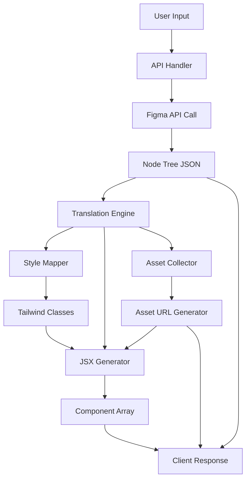

# 🎨 Figma-to-Next.js Code Extractor - Complete Design Specification

## 📋 Table of Contents
1. [Project Overview](#project-overview)
2. [Architecture & Data Flow](#architecture--data-flow)
3. [Technical Stack](#technical-stack)
4. [Component Structure](#component-structure)
5. [API Design](#api-design)
6. [Core Translation Engine](#core-translation-engine)
7. [UI/UX Design](#uiux-design)
8. [Security Considerations](#security-considerations)
9. [Error Handling](#error-handling)
10. [Performance Optimization](#performance-optimization)

---

## 🎯 Project Overview

### Purpose
A server-side tool that translates Figma design files into production-ready React/Next.js components with Tailwind CSS styling, complete with asset URLs and raw design data.

### Key Features
- 🔐 Secure PAT-based Figma API authentication
- 🎨 Automatic Figma → Tailwind CSS translation
- 📦 Multi-page component generation (one JSX file per page)
- 🖼️ Direct asset URL extraction (no local downloads)
- 📊 Raw design data export (JSON structure)
- 📋 One-click code copying
- 🎯 High-fidelity design replication

### User Workflow
```
User Input (URL + PAT) 
  → Server Fetches Design 
  → Translation Engine Processes 
  → Asset URLs Generated 
  → Client Displays Code 
  → Download/Copy Options
```

---

## 🏗️ Architecture & Data Flow

### System Architecture

```
┌─────────────────────────────────────────────────────────────┐
│                     CLIENT (Browser)                        │
│  ┌────────────────────────────────────────────────────┐    │
│  │  FigmaExtractorTool.tsx                            │    │
│  │  - Input Form (URL + PAT)                          │    │
│  │  - Component Display/Tabs                          │    │
│  │  - Download Buttons                                │    │
│  └──────────────────┬─────────────────────────────────┘    │
└────────────────────┼──────────────────────────────────────┘
                     │ HTTPS POST
                     ▼
┌─────────────────────────────────────────────────────────────┐
│              SERVER (Next.js API Route)                     │
│  ┌────────────────────────────────────────────────────┐    │
│  │  /api/figma-extract/route.ts                       │    │
│  │  - Request validation                              │    │
│  │  - FigmaClient initialization                      │    │
│  └──────────────────┬─────────────────────────────────┘    │
│                     ▼                                       │
│  ┌────────────────────────────────────────────────────┐    │
│  │  FigmaClient.ts                                    │    │
│  │  - API authentication                              │    │
│  │  - File key parsing                                │    │
│  │  - GET /v1/files/:file_key                         │    │
│  │  - GET /v1/images/:file_key (batch)                │    │
│  └──────────────────┬─────────────────────────────────┘    │
│                     ▼                                       │
│  ┌────────────────────────────────────────────────────┐    │
│  │  TranslationEngine.ts                              │    │
│  │  - Recursive node traversal                        │    │
│  │  - Style mapping (Figma → Tailwind)                │    │
│  │  - JSX generation (per page)                       │    │
│  │  - Asset URL injection                             │    │
│  └──────────────────┬─────────────────────────────────┘    │
│                     ▼                                       │
│  ┌────────────────────────────────────────────────────┐    │
│  │  Return JSON Response                              │    │
│  │  {                                                 │    │
│  │    components: [{name, jsx}],                      │    │
│  │    assets: [{id, url, type}],                      │    │
│  │    rawData: {...nodeTree}                          │    │
│  │  }                                                 │    │
│  └────────────────────────────────────────────────────┘    │
└─────────────────────────────────────────────────────────────┘
```

### Data Pipeline



---

## 🛠️ Technical Stack

| Technology | Version | Purpose |
|------------|---------|---------|
| **Next.js** | 14+ (App Router) | Framework & Server Actions |
| **React** | 18+ | Component library |
| **TypeScript** | 5+ | Type safety |
| **Tailwind CSS** | 3+ | Output styling system |
| **Axios** | 1.6+ | HTTP client for Figma API |
| **Zod** | 3+ | Input validation |
| **Zustand** | 4+ | Client state management (optional) |

### Dependencies to Install

```json
{
  "dependencies": {
    "axios": "^1.6.0",
    "zod": "^3.22.0"
  },
  "devDependencies": {
    "@types/node": "^20.0.0"
  }
}
```

---

## 📦 Component Structure

### File Organization

```
src/
├── app/
│   └── tools/
│       └── code/
│           └── figma-to-code/
│               └── page.tsx                    # Tool page wrapper
├── components/
│   └── tools/
│       └── figma-to-code/
│           ├── FigmaExtractorTool.tsx         # Main component
│           ├── InputForm.tsx                  # URL + PAT input
│           ├── ComponentTabs.tsx              # Multi-page tab view
│           ├── CodeDisplay.tsx                # Syntax-highlighted code
│           ├── AssetList.tsx                  # Asset URL list
│           ├── DownloadPanel.tsx              # Download buttons
│           └── ProgressIndicator.tsx          # Loading states
├── lib/
│   └── figma/
│       ├── client.ts                          # Figma API client
│       ├── translator.ts                      # Translation engine
│       ├── style-mapper.ts                    # Figma → Tailwind
│       ├── jsx-generator.ts                   # JSX string builder
│       ├── asset-manager.ts                   # Asset URL handler
│       ├── types.ts                           # TypeScript types
│       └── constants.ts                       # Mapping constants
└── app/
    └── api/
        └── figma-extract/
            └── route.ts                       # API endpoint
```

---

## 🔌 API Design

### API Endpoint: `/api/figma-extract`

#### Request

```typescript
POST /api/figma-extract

Headers:
  Content-Type: application/json

Body:
{
  "figmaUrl": "https://www.figma.com/file/ABC123/Project-Name",
  "personalAccessToken": "figd_xxxxx..."
}
```

#### Response (Success)

```typescript
{
  "success": true,
  "data": {
    "components": [
      {
        "name": "Page1",
        "jsx": "export default function Page1() {...}",
        "nodeId": "0:1"
      },
      {
        "name": "Page2",
        "jsx": "export default function Page2() {...}",
        "nodeId": "0:2"
      }
    ],
    "assets": [
      {
        "id": "123:45",
        "name": "hero-image",
        "type": "PNG",
        "url": "https://s3-alpha.figma.com/img/...",
        "width": 1200,
        "height": 800
      }
    ],
    "rawData": {
      "name": "Project Name",
      "lastModified": "2025-10-31T...",
      "version": "1234567890",
      "document": {...}
    },
    "metadata": {
      "totalPages": 2,
      "totalAssets": 15,
      "processingTime": 3.2
    }
  }
}
```

#### Response (Error)

```typescript
{
  "success": false,
  "error": {
    "code": "INVALID_TOKEN" | "FILE_NOT_FOUND" | "API_ERROR" | "TRANSLATION_ERROR",
    "message": "Detailed error message",
    "details": {...}
  }
}
```

---

## 🎨 Core Translation Engine

### 1. Node Traversal Algorithm

```typescript
interface FigmaNode {
  id: string;
  name: string;
  type: string;
  children?: FigmaNode[];
  absoluteBoundingBox?: BoundingBox;
  // ... other properties
}

function traverseNode(
  node: FigmaNode,
  depth: number = 0
): JSXElement {
  const element: JSXElement = {
    type: mapNodeType(node.type),
    props: {},
    children: [],
    styles: []
  };

  // Map styles
  element.styles = mapStyles(node);
  
  // Map attributes
  element.props = mapAttributes(node);
  
  // Process children recursively
  if (node.children) {
    element.children = node.children.map(child => 
      traverseNode(child, depth + 1)
    );
  }
  
  return element;
}
```

### 2. Figma → Tailwind Style Mapping

#### Auto Layout → Flexbox

```typescript
interface StyleMapper {
  mapAutoLayout(node: FigmaNode): string[] {
    const classes: string[] = [];
    
    // Base flex container
    if (node.layoutMode) {
      classes.push('flex');
      
      // Direction
      if (node.layoutMode === 'HORIZONTAL') {
        classes.push('flex-row');
      } else if (node.layoutMode === 'VERTICAL') {
        classes.push('flex-col');
      }
      
      // Item spacing
      if (node.itemSpacing) {
        classes.push(mapSpacing(node.itemSpacing));
      }
      
      // Alignment - Primary Axis
      if (node.primaryAxisAlignItems === 'CENTER') {
        classes.push('justify-center');
      } else if (node.primaryAxisAlignItems === 'SPACE_BETWEEN') {
        classes.push('justify-between');
      } else if (node.primaryAxisAlignItems === 'FLEX_END') {
        classes.push('justify-end');
      }
      
      // Alignment - Counter Axis
      if (node.counterAxisAlignItems === 'CENTER') {
        classes.push('items-center');
      } else if (node.counterAxisAlignItems === 'FLEX_END') {
        classes.push('items-end');
      }
      
      // Padding
      if (node.paddingTop || node.paddingRight || node.paddingBottom || node.paddingLeft) {
        classes.push(mapPadding(node));
      }
    }
    
    return classes;
  }
}
```

#### Spacing Conversion

```typescript
const SPACING_MAP: Record<number, string> = {
  0: 'gap-0',
  4: 'gap-1',
  8: 'gap-2',
  12: 'gap-3',
  16: 'gap-4',
  20: 'gap-5',
  24: 'gap-6',
  32: 'gap-8',
  40: 'gap-10',
  48: 'gap-12',
  64: 'gap-16',
};

function mapSpacing(px: number): string {
  // Try to match Tailwind scale
  if (SPACING_MAP[px]) {
    return SPACING_MAP[px];
  }
  
  // Use arbitrary value for non-standard spacing
  return `gap-[${px}px]`;
}
```

#### Color Mapping

```typescript
function mapColor(figmaColor: RGB | RGBA): string {
  const { r, g, b, a = 1 } = figmaColor;
  
  // Convert 0-1 range to 0-255
  const red = Math.round(r * 255);
  const green = Math.round(g * 255);
  const blue = Math.round(b * 255);
  
  // Convert to hex
  const hex = `#${red.toString(16).padStart(2, '0')}${green.toString(16).padStart(2, '0')}${blue.toString(16).padStart(2, '0')}`;
  
  if (a < 1) {
    // Handle transparency
    return `bg-[${hex}] bg-opacity-${Math.round(a * 100)}`;
  }
  
  return `bg-[${hex}]`;
}
```

#### Typography Mapping

```typescript
function mapTypography(textNode: FigmaTextNode): string[] {
  const classes: string[] = [];
  
  // Font size
  if (textNode.fontSize) {
    classes.push(`text-[${textNode.fontSize}px]`);
  }
  
  // Font weight
  const weightMap: Record<number, string> = {
    100: 'font-thin',
    200: 'font-extralight',
    300: 'font-light',
    400: 'font-normal',
    500: 'font-medium',
    600: 'font-semibold',
    700: 'font-bold',
    800: 'font-extrabold',
    900: 'font-black',
  };
  
  if (textNode.fontWeight && weightMap[textNode.fontWeight]) {
    classes.push(weightMap[textNode.fontWeight]);
  }
  
  // Line height
  if (textNode.lineHeightPx) {
    classes.push(`leading-[${textNode.lineHeightPx}px]`);
  }
  
  // Text alignment
  const alignMap: Record<string, string> = {
    'LEFT': 'text-left',
    'CENTER': 'text-center',
    'RIGHT': 'text-right',
    'JUSTIFIED': 'text-justify',
  };
  
  if (textNode.textAlignHorizontal && alignMap[textNode.textAlignHorizontal]) {
    classes.push(alignMap[textNode.textAlignHorizontal]);
  }
  
  return classes;
}
```

### 3. JSX Generation

```typescript
function generateJSX(element: JSXElement, indent: number = 0): string {
  const indentation = '  '.repeat(indent);
  const className = element.styles.join(' ');
  
  let jsx = `${indentation}<${element.type}`;
  
  // Add className if exists
  if (className) {
    jsx += ` className="${className}"`;
  }
  
  // Add other props
  Object.entries(element.props).forEach(([key, value]) => {
    if (typeof value === 'string') {
      jsx += ` ${key}="${value}"`;
    } else {
      jsx += ` ${key}={${JSON.stringify(value)}}`;
    }
  });
  
  // Self-closing or with children
  if (element.children.length === 0 && !element.content) {
    jsx += ' />';
  } else {
    jsx += '>\n';
    
    // Content (for text nodes)
    if (element.content) {
      jsx += `${indentation}  ${element.content}\n`;
    }
    
    // Children
    element.children.forEach(child => {
      jsx += generateJSX(child, indent + 1) + '\n';
    });
    
    jsx += `${indentation}</${element.type}>`;
  }
  
  return jsx;
}

function generateComponent(name: string, rootElement: JSXElement): string {
  const jsx = generateJSX(rootElement, 2);
  
  return `export default function ${name}() {
  return (
${jsx}
  );
}`;
}
```

### 4. Asset URL Generation

```typescript
async function getAssetUrls(
  fileKey: string,
  nodeIds: string[],
  token: string
): Promise<AssetUrl[]> {
  // Batch request (max 100 IDs per request)
  const batches = chunkArray(nodeIds, 100);
  const results: AssetUrl[] = [];
  
  for (const batch of batches) {
    const response = await axios.get(
      `https://api.figma.com/v1/images/${fileKey}`,
      {
        params: {
          ids: batch.join(','),
          format: 'png',
          scale: 2, // Retina quality
        },
        headers: {
          'X-Figma-Token': token,
        },
      }
    );
    
    Object.entries(response.data.images).forEach(([id, url]) => {
      results.push({
        id,
        url: url as string,
        type: 'PNG',
      });
    });
  }
  
  return results;
}
```

---

## 🎨 UI/UX Design

### Main Interface Layout

```
┌─────────────────────────────────────────────────────────┐
│  🎨 Figma to Next.js Code Extractor                    │
├─────────────────────────────────────────────────────────┤
│                                                         │
│  ┌──────────────────────────────────────────────────┐  │
│  │ 🔗 Figma File URL                                │  │
│  │ [_______________________________________]         │  │
│  │                                                   │  │
│  │ 🔑 Personal Access Token                         │  │
│  │ [_______________________________________] 👁️     │  │
│  │                                                   │  │
│  │           [ Extract Components ]                 │  │
│  └──────────────────────────────────────────────────┘  │
│                                                         │
│  ┌──────────────────────────────────────────────────┐  │
│  │ 📊 Results                                        │  │
│  │ ┌──────────────────────────────────────────────┐ │  │
│  │ │ [Page1] [Page2] [Page3]                      │ │  │
│  │ └──────────────────────────────────────────────┘ │  │
│  │                                                   │  │
│  │ ┌──────────────────────────────────────────────┐ │  │
│  │ │ export default function Page1() {            │ │  │
│  │ │   return (                                   │ │  │
│  │ │     <div className="flex flex-col...">       │ │  │
│  │ │       ...                                    │ │  │
│  │ │     </div>                                   │ │  │
│  │ │   );                                         │ │  │
│  │ │ }                                            │ │  │
│  │ └──────────────────────────────────────────────┘ │  │
│  │                                                   │  │
│  │ [📋 Copy Code] [⬇️ Download Assets] [📄 Get JSON] │  │
│  └──────────────────────────────────────────────────┘  │
│                                                         │
└─────────────────────────────────────────────────────────┘
```

### Component States

1. **Initial State**: Empty form
2. **Loading State**: Progress indicator with steps
3. **Success State**: Tabs with code display
4. **Error State**: Error message with retry option

---

## 🔒 Security Considerations

### 1. PAT Handling
- ✅ Never store PAT in client state
- ✅ Never log PAT in console or errors
- ✅ Use server-side only processing
- ✅ Clear PAT from memory after use

### 2. Input Validation
```typescript
const FigmaExtractSchema = z.object({
  figmaUrl: z.string().url().regex(/figma\.com\/file\//),
  personalAccessToken: z.string().min(10).startsWith('figd_'),
});
```

### 3. Rate Limiting
- Implement request throttling
- Cache responses for repeated requests
- Display rate limit status to user

---

## ❌ Error Handling

### Error Types & User Messages

```typescript
const ERROR_MESSAGES = {
  INVALID_TOKEN: 'Invalid Personal Access Token. Please check and try again.',
  FILE_NOT_FOUND: 'Figma file not found. Ensure the file is accessible with this token.',
  RATE_LIMIT: 'API rate limit reached. Please try again in a few minutes.',
  NETWORK_ERROR: 'Network error. Please check your connection.',
  TRANSLATION_ERROR: 'Error translating design. The file may have unsupported features.',
  TIMEOUT: 'Request timeout. The file may be too large.',
};
```

---

## ⚡ Performance Optimization

### 1. Caching Strategy
- Cache file structure for 5 minutes
- Cache asset URLs for 12 hours
- Use browser localStorage for recent files

### 2. Lazy Loading
- Load component tabs on-demand
- Render visible code only (virtualization)

### 3. Progressive Enhancement
- Show structure preview before full translation
- Stream components as they're generated

---

## 📊 Complete Type Definitions

```typescript
// Core Types
interface FigmaNode {
  id: string;
  name: string;
  type: NodeType;
  visible?: boolean;
  children?: FigmaNode[];
  absoluteBoundingBox?: BoundingBox;
  fills?: Paint[];
  strokes?: Paint[];
  strokeWeight?: number;
  cornerRadius?: number;
  layoutMode?: 'NONE' | 'HORIZONTAL' | 'VERTICAL';
  primaryAxisAlignItems?: 'MIN' | 'CENTER' | 'MAX' | 'SPACE_BETWEEN';
  counterAxisAlignItems?: 'MIN' | 'CENTER' | 'MAX';
  itemSpacing?: number;
  paddingTop?: number;
  paddingRight?: number;
  paddingBottom?: number;
  paddingLeft?: number;
  characters?: string;
  style?: TextStyle;
}

interface JSXElement {
  type: string;
  props: Record<string, any>;
  styles: string[];
  children: JSXElement[];
  content?: string;
}

interface GeneratedComponent {
  name: string;
  jsx: string;
  nodeId: string;
}

interface AssetUrl {
  id: string;
  name: string;
  type: 'PNG' | 'JPG' | 'SVG';
  url: string;
  width?: number;
  height?: number;
}

interface ExtractResult {
  components: GeneratedComponent[];
  assets: AssetUrl[];
  rawData: any;
  metadata: {
    totalPages: number;
    totalAssets: number;
    processingTime: number;
  };
}
```

---

## 🎯 Success Metrics

- ✅ Successfully extract 95%+ of common Figma elements
- ✅ Generate valid, formatted JSX code
- ✅ Accurate Tailwind class mapping (90%+ match)
- ✅ Process typical design file in < 10 seconds
- ✅ Zero PAT security breaches
- ✅ Clear error messages for all failure cases

---

## 📚 Additional Resources

### Figma API Documentation
- [Figma REST API](https://www.figma.com/developers/api)
- [Node Types Reference](https://www.figma.com/developers/api#node-types)
- [Authentication](https://www.figma.com/developers/api#authentication)

### Tailwind CSS
- [Utility Classes](https://tailwindcss.com/docs)
- [Arbitrary Values](https://tailwindcss.com/docs/adding-custom-styles#using-arbitrary-values)

---

**Last Updated**: October 31, 2025  
**Design Version**: 1.0  
**Status**: Ready for Implementation 🚀
