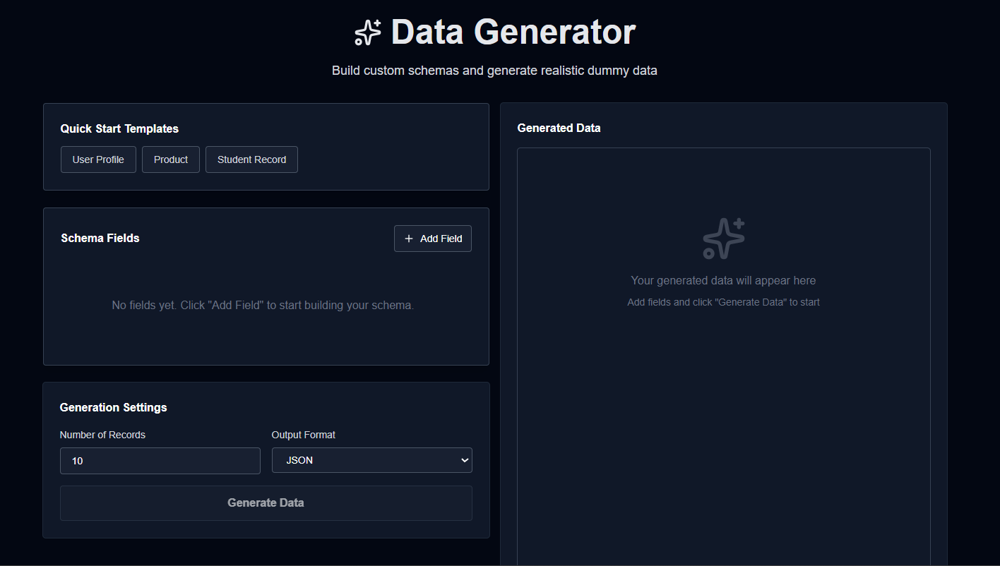
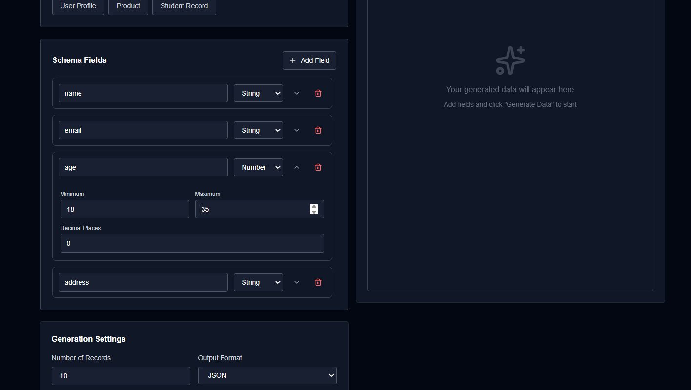
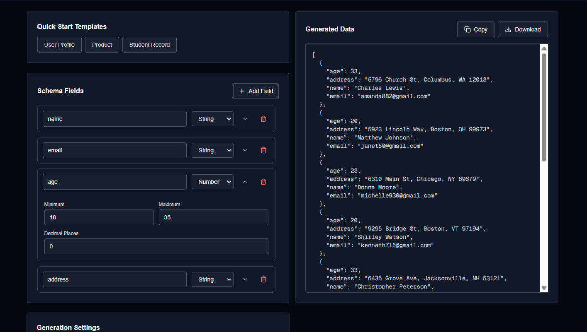
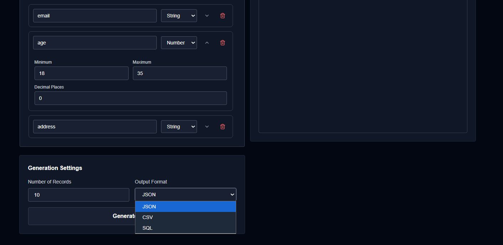
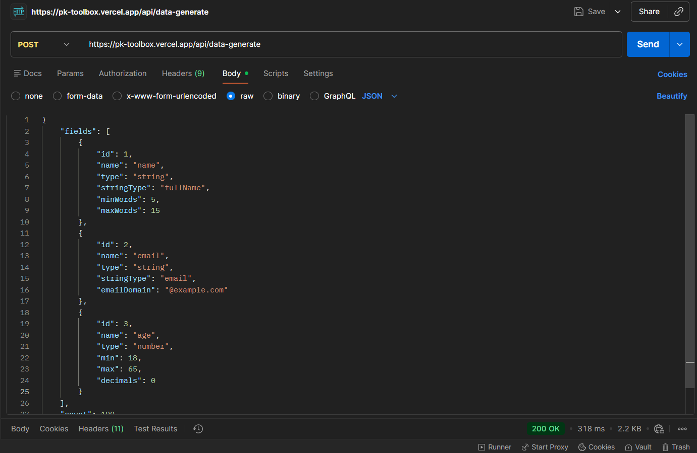
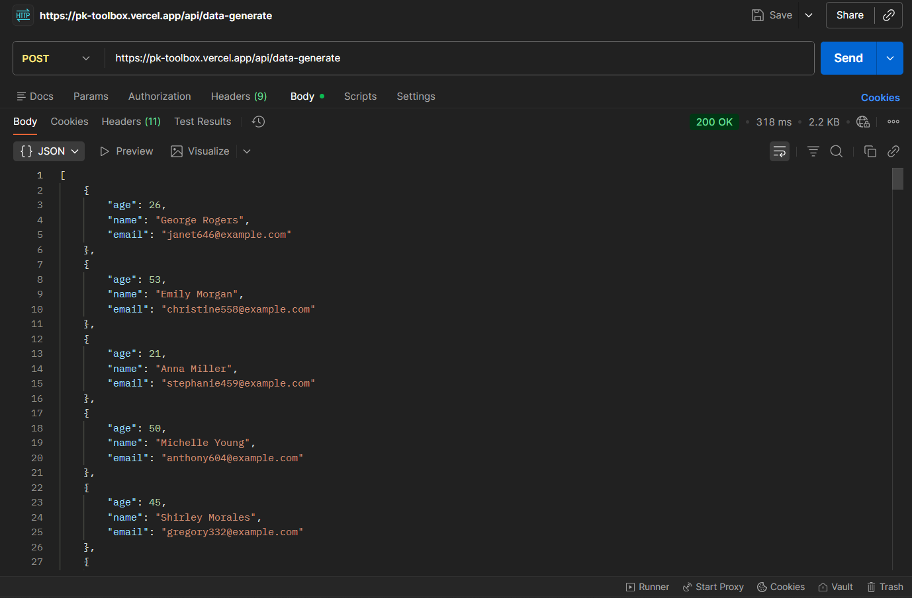

# Data Generator Tool

A powerful, intelligent data generation tool that creates realistic dummy data for testing, development, and prototyping. Built with Next.js and React, featuring smart field correlation and multiple export formats.


## 🎯 Overview

The Data Generator is a sophisticated tool designed to generate realistic dummy data with intelligent field correlation. Whether you need test data for development, sample datasets for demos, or mock data for prototyping, this tool provides a flexible schema builder with instant data generation.

### Key Capabilities:
- **Custom Schema Builder** - Define your own data structure with multiple field types
- **Smart Correlation** - Related fields automatically correlate (names, emails, grades)
- **Multiple Formats** - Export as JSON, CSV, or SQL INSERT statements
- **Template Library** - Quick-start templates for common use cases
- **Real-time Generation** - Instant preview of generated data
- **Order-Independent** - Field dependencies work regardless of field order


*Main interface showing schema builder and output panel*

---

## ✨ Features

### 🎨 Schema Builder
- **Drag-and-Drop Field Management** - Add, remove, and configure fields easily
- **Field Type Selection** - String, Number, and Boolean types
- **Advanced Configuration** - Customize min/max values, word counts, prefixes, and more
- **Expandable Fields** - Clean interface with collapsible field settings


*Schema builder with expandable field configuration*

### 🧠 Smart Field Correlation

The generator intelligently correlates related fields for realistic data:

#### Name Correlation (Bidirectional)
- **fullName ↔ firstName + lastName** - Works in ANY order
- If `fullName` exists: extracts `firstName` and `lastName`
- If `firstName` + `lastName` exist: combines into `fullName`
- Supports variations: `first`, `firstname`, `first_name`, `last`, `lastname`, `last_name`, `name`


*Example showing correlated name fields*

#### Email Correlation
- Uses `firstName` (or variations) as email base
- Customizable domain support (e.g., @gmail.com, @example.com)
- Example: `firstName: "John"` → `email: "john123@gmail.com"`

#### Grade & Marks Correlation (Bidirectional)
- **grade ↔ marks/score/percentage** - Works in ANY order
- If `grade` exists: generates `marks` in appropriate range
  - Grade S → 90-100
  - Grade A → 80-89
  - Grade B → 70-79
  - Grade C → 60-69
  - Grade D → 50-59
  - Grade E → 40-49
  - Grade F → 0-39
- If `marks` exists: calculates appropriate `grade`


*Bidirectional grade and marks correlation*

### 📦 Quick Start Templates

Pre-built templates for common scenarios:
- **User Profile** - Name, email, age, address
- **E-commerce** - Product name, price, category, stock
- **Student Records** - Name, roll number, marks, grade
- **Employee Data** - Name, email, department, salary


*Quick start templates for instant schema creation*

---

## 🔧 Supported Field Types

### String Types
| Type | Description | Customization |
|------|-------------|---------------|
| **Random Text** | Lorem ipsum text | Min/max words |
| **Sentence** | Complete sentences | Word count control |
| **Paragraph** | Multi-sentence paragraphs | Length control |
| **First Name** | Random first names | Smart extraction from fullName |
| **Last Name** | Random last names | Smart extraction from fullName |
| **Full Name** | Complete names | Smart combination of first/last |
| **Email** | Email addresses | Custom domain support |
| **Phone** | US phone numbers | Standard format |
| **Address** | Street addresses | Realistic US addresses |
| **City** | City names | US cities |
| **State** | State names | US states |
| **Grade** | Letter grades (S-F) | Smart calculation from marks |
| **Gender** | Male/Female/Other | Random selection |
| **Password** | Secure passwords | Customizable length & composition |

### Number Type
- Random integers or decimals
- Configurable min/max range
- Decimal places control
- Smart marks generation from grade

### Boolean Type
- Random true/false values
- Perfect for flags and toggles


*Comprehensive field type options*

---

## 📤 Export Formats

### JSON
```json
[
  {
    "fullname": "Sandra Green",
    "first": "Sandra",
    "email": "sandra608@gmail.com",
    "age": 67,
    "address": "6304 Pine Rd, Houston, MO 51319"
  }
]
```
Returns parsed JSON array ready for immediate use.

### CSV
```csv
fullname,first,email,age,address
Sandra Green,Sandra,sandra608@gmail.com,67,"6304 Pine Rd, Houston, MO 51319"
```
Compatible with Excel, Google Sheets, and database import tools.

### SQL
```sql
INSERT INTO table_name (fullname, first, email, age, address) VALUES
('Sandra Green', 'Sandra', 'sandra608@gmail.com', 67, '6304 Pine Rd, Houston, MO 51319');
```
Ready-to-execute SQL INSERT statements.

