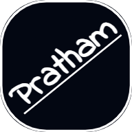
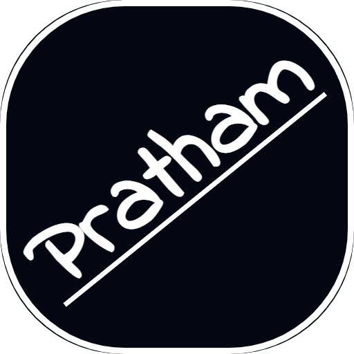
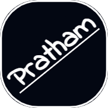
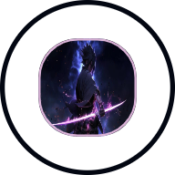
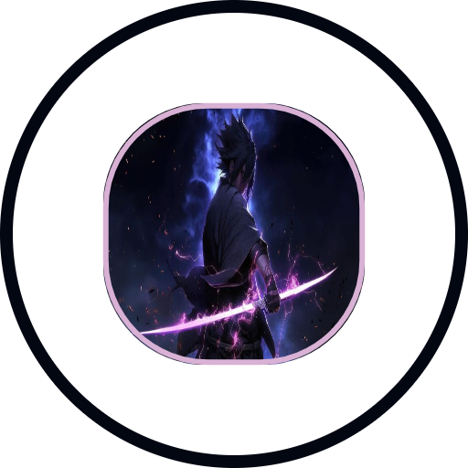
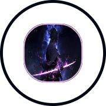

# Favicon Generator - Complete Guide

## 🎯 Overview

A professional favicon generator that creates multi-size favicon packages from text or images. Generate beautiful favicons with advanced customization options including Google Fonts, borders, shapes, and transparent backgrounds.

**Features:**
- **Text to Favicon**: Create favicons from custom text with 50+ Google Fonts
- **Image to Favicon**: Convert any image to favicon format
- Advanced styling (rotation, borders, shapes, transparency)
- Multiple sizes in one download (16×16 to 512×512)
- Real-time canvas preview
- Dark theme interface

---

## 📱 Getting Started

### Navigation
1. Go to **Tools → Files → Favicon Generator**
2. Choose your mode: **Text to ICO** or **Image to ICO**
3. Customize your design
4. Preview in real-time
5. Click "Download Favicons" to get a ZIP file with all sizes

---

## 🎨 Text to ICO Mode

Perfect for creating letter-based or emoji favicons.


### Text Settings

#### **Text Input**
- Enter any text (letters, numbers, symbols)
- Supports emojis (👍, 🚀, ⭐, etc.)
- Best with 1-3 characters for clarity

#### **Text Rotation**
- Range: -180° to 180°
- Use for creative diagonal text
- Real-time preview updates

#### **Text Styles**
- ✅ **Bold** - Make text heavier
- ✅ **Italic** - Slant text
- ✅ **Underline** - Add underline

#### **Font Family**
Choose from **50+ Google Fonts**:
- **Classic**: Roboto, Open Sans, Lato, Montserrat
- **Display**: Playfair Display, Bebas Neue, Anton
- **Handwriting**: Dancing Script, Pacifico, Indie Flower
- **Monospace**: Courier Prime, VT323, Press Start 2P
- **Fun**: Permanent Marker, Satisfy, Lobster

All fonts load dynamically with proper bold and italic support!

#### **Font Size**
- Range: 30px to 400px
- Auto-scales to canvas (512×512 base)
- Adjust for perfect fit

#### **Font Color**
- Color picker for quick selection
- Or enter HEX value manually (e.g., #FF5733)
- Supports any color

### Generated Icons (Text Mode)

Here are the favicon sizes generated from text:

| 16×16 | 32×32 | 64×64 | 192×192 | 512×512 | Apple Touch |
|:---:|:---:|:---:|:---:|:---:|:---:|
|  |  |  |  |  |  |

---

## 🖼️ Image to ICO Mode

Convert any image (logo, icon, photo) into favicons.


### Image Settings

#### **Upload Image**
- Supported formats: PNG, JPG, SVG, WebP
- Click "Choose File" to upload
- Image scales automatically

#### **Image Size**
- Range: 20% to 100%
- Controls how much of the canvas the image fills
- Smaller = more padding

#### **Image Shape**
Choose from 8 border radius options:
- **None** - Square corners
- **Small** (8px) - Slight rounding
- **Medium** (16px) - Moderate rounding
- **Large** (32px) - Rounded corners
- **XLarge** (48px) - Very rounded
- **XXLarge** (64px) - Super rounded
- **XXXLarge** (96px) - Extreme rounding
- **Circle** - Perfect circle

#### **Image Border**
- **Thickness**: 0-50px
- **Color**: Any color or transparent
- **Transparent toggle**: For borderless look

### Generated Icons (Image Mode)

Here are the favicon sizes generated from an image:

| 16×16 | 32×32 | 64×64 | 192×192 | 512×512 | Apple Touch |
|:---:|:---:|:---:|:---:|:---:|:---:|
|  |  |  |  |  |  |

---

## 🎨 Background & Main Border

Settings shared across both modes.


### Background Color
- **Color Picker**: Choose any background color
- **HEX Input**: Enter precise color codes
- **Transparent Toggle**: Make background transparent
  - Perfect for modern PWA icons
  - Works great on any background

### Main Border Shape
Same 8 options as image shape:
- None, Small, Medium, Large, XLarge, XXLarge, XXXLarge, Circle

### Main Border Settings
- **Thickness**: 0-50px outer border
- **Color**: Any color or transparent
- **Transparent Toggle**: For borderless style

---

## 📦 Download Package


Click **"Download Favicons"** to get a ZIP file containing:

### Included Files
```
favicons.zip
├── favicon-16x16.png      # Browser tab icon
├── favicon-32x32.png      # Browser tab icon (retina)
├── favicon-64x64.png      # High-res browser icon
├── android-chrome-192x192.png   # Android home screen
├── android-chrome-512x512.png   # Android splash screen
└── apple-touch-icon.png   # iOS home screen (180×180)
```

### How to Use in Your Website

1. **Extract the ZIP file** to your project's `public` folder

2. **Add to your HTML** `<head>` section:
```html
<!-- Favicons -->
<link rel="icon" type="image/png" sizes="32x32" href="/favicon-32x32.png">
<link rel="icon" type="image/png" sizes="16x16" href="/favicon-16x16.png">
<link rel="apple-touch-icon" sizes="180x180" href="/apple-touch-icon.png">

<!-- Android/Chrome -->
<link rel="icon" type="image/png" sizes="192x192" href="/android-chrome-192x192.png">
<link rel="icon" type="image/png" sizes="512x512" href="/android-chrome-512x512.png">
```

3. **For PWA apps**, add to your `manifest.json`:
```json
{
  "icons": [
    {
      "src": "/android-chrome-192x192.png",
      "sizes": "192x192",
      "type": "image/png"
    },
    {
      "src": "/android-chrome-512x512.png",
      "sizes": "512x512",
      "type": "image/png"
    }
  ]
}
```

---

## 💡 Tips & Best Practices

### For Text-based Favicons
✅ **Use 1-3 characters** for best clarity at small sizes  
✅ **Choose bold fonts** like Bebas Neue, Anton, Rubik for better visibility  
✅ **High contrast** between text and background (dark on light or vice versa)  
✅ **Test emojis** - they work great as favicons! (🚀, 💡, ⚡, 🎯)  
✅ **Avoid italic** on small sizes (can be hard to read)

### For Image-based Favicons
✅ **Use simple logos** with clear shapes  
✅ **High contrast** images work best  
✅ **Square or circular** compositions are ideal  
✅ **Remove complex details** that won't show at 16×16  
✅ **Test at small size** to ensure recognizability  
✅ **Use transparent backgrounds** for modern look

### General Tips
✅ **Preview before download** - Check the canvas preview  
✅ **Test on mobile** - iOS and Android handle icons differently  
✅ **Keep it simple** - Complex designs don't scale well  
✅ **Brand colors** - Use your brand's color palette  
✅ **Transparent backgrounds** - More versatile across platforms

---

## 🎨 Example Designs

### Minimalist Letter
- **Text**: "T"
- **Font**: Montserrat Bold
- **BG**: Gradient blue to purple
- **Result**: Clean, professional look


### Logo Icon
- **Mode**: Image to ICO
- **Shape**: Circle
- **BG**: Transparent
- **Result**: Modern, clean icon

### Emoji Fun
- **Text**: "🚀"
- **BG**: Transparent
- **Border**: None
- **Result**: Fun, eye-catching

---

## 🎯 Use Cases

### **Personal Websites**
- Use your initials (e.g., "JD")
- Simple emoji representing you
- Personal logo or avatar

### **Business Sites**
- Company logo
- First letter of business name
- Brand symbol

### **Web Apps / PWA**
- App icon character
- Functional symbol (📊, 🎵, 📝)
- Brand mark

### **Portfolios**
- Your monogram
- Professional headshot
- Creative symbol

### **Blogs**
- Blog topic emoji
- First letter of blog name
- Custom doodle/icon

---

## 🛠️ Technical Details

### Output Formats
- All images are **PNG** format
- **24-bit RGB** color depth
- **Alpha channel** support (transparency)
- Optimized file sizes

### Browser Support
- ✅ Chrome/Edge (all sizes)
- ✅ Firefox (16×16, 32×32)
- ✅ Safari (all sizes + Apple Touch)
- ✅ iOS Safari (Apple Touch Icon)
- ✅ Android Chrome (192×192, 512×512)

### Canvas Rendering
- Base resolution: **512×512**
- Dynamic scaling for all sizes
- Anti-aliased rendering
- Font loading with fallbacks

---

## 🚀 Quick Start Examples

### Example 1: Tech Startup
```
Mode: Text to ICO
Text: "TS"
Font: Bebas Neue
Font Color: #FFFFFF
BG Color: #3B82F6
Main Border: Large (32px)
Border Color: #1E40AF
```

### Example 2: Personal Blog
```
Mode: Text to ICO
Text: "✍️"
BG: Transparent
Font Size: 350px
Main Border: None
```

### Example 3: Company Logo
```
Mode: Image to ICO
Upload: company-logo.png
Image Size: 80%
Image Shape: Circle
BG: #FFFFFF
Main Border: None
```

---

## ❓ FAQ

**Q: Can I use custom fonts not in the list?**  
A: Currently, only the 50+ Google Fonts provided are supported. They cover most use cases.

**Q: What's the maximum file upload size for images?**  
A: Most common image sizes work fine. Very large images (>5MB) may take longer to process.

**Q: Can I edit the icons after download?**  
A: Yes! They're standard PNG files. Open in any image editor. However, it's easier to regenerate with new settings.

**Q: Do transparent backgrounds work on all devices?**  
A: Yes, but some older browsers may show a default background color.

**Q: How do I make a circular favicon?**  
A: Set Main Border Shape to "Circle". Works for both text and image modes.

**Q: Why are Google Fonts sometimes slow to load?**  
A: Fonts are loaded from Google Fonts CDN. First load may take a moment, then they're cached.

**Q: Can I use this for commercial projects?**  
A: Yes! All generated icons are yours to use freely.

---

## 🎨 Color Palette Ideas

### Professional
- 🔵 Blue: `#3B82F6` (Tech, Trust)
- 🟣 Purple: `#8B5CF6` (Creative, Modern)
- 🟢 Green: `#10B981` (Growth, Eco)

### Vibrant
- 🔴 Red: `#EF4444` (Energy, Bold)
- 🟡 Yellow: `#F59E0B` (Happy, Optimistic)
- 🟠 Orange: `#F97316` (Friendly, Warm)

### Dark Mode
- ⚫ Dark: `#1F2937` (Sophisticated)
- 🟤 Charcoal: `#374151` (Modern)
- 🔵 Navy: `#1E40AF` (Professional)

### Gradients
- Sunset: `#F97316` → `#EF4444`
- Ocean: `#3B82F6` → `#8B5CF6`
- Forest: `#10B981` → `#059669`

---

## 📝 Conclusion

The Favicon Generator provides everything you need to create professional favicons for any project. Whether you prefer text-based designs or image conversions, the tool offers extensive customization options with instant preview.

**Key Takeaways:**
- ✅ Two modes: Text and Image
- ✅ 50+ Google Fonts
- ✅ Advanced styling options
- ✅ All sizes in one download
- ✅ Real-time preview
- ✅ Easy implementation

Start creating your perfect favicon now! 🚀

---

*Made with ❤️ by PoolBox - Your all-in-one developer toolbox*
