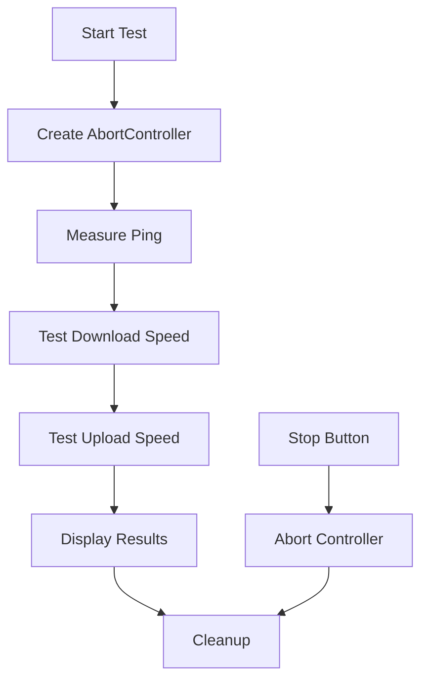

# Internet Speed Test Tool

A modern, browser-based internet speed testing tool built with Next.js and React. Test your download speed, upload speed, and network latency with a beautiful, responsive interface.


---

## 📋 Table of Contents

- [Overview](#overview)
- [Development Journey](#development-journey)
- [How It Works](#how-it-works)
- [Features](#features)
- [Technical Implementation](#technical-implementation)
- [Dependencies](#dependencies)
- [Usage](#usage)

---

## 🎯 Overview

This speed test tool provides accurate internet connection metrics using Cloudflare's global CDN for download testing and a custom API endpoint for upload testing. The interface features real-time animated radial gauges that update dynamically during testing.

### Key Metrics Tested:
- **Download Speed** (Mbps)
- **Upload Speed** (Mbps)
- **Latency/Ping** (ms)
---

## 🛠️ Development Journey

### Attempt 1: speedtest-net
**Package**: [`speedtest-net`](https://www.npmjs.com/package/speedtest-net)

We initially tried using the `speedtest-net` package, which is a Node.js wrapper for the Speedtest.net CLI.

**Problem**: ❌ Failed on Windows
- The package relies on native binaries that don't work reliably across all platforms
- Encountered compatibility issues with Windows systems
- Required system-level dependencies that complicated deployment

### Attempt 2: fast-speedtest-api
**Package**: [`fast-speedtest-api`](https://www.npmjs.com/package/fast-speedtest-api)

Next, we attempted to use `fast-speedtest-api`, which provides an API interface to Fast.com's speed testing service.

**Problem**: ❌ Inaccurate Results
- Provided inconsistent and unreliable speed measurements
- Results didn't match actual internet speeds
- API responses were often delayed or timed out
- Lack of granular control over testing parameters

### Attempt 3: Cloudflare Speed Test ✅ (Final Solution)

**Service**: [Cloudflare Speed Test](https://speed.cloudflare.com/)

After multiple attempts, we found success using Cloudflare's CDN infrastructure directly.

**Why It Works**: ✅
- **Browser-native**: Runs entirely in the browser using the Fetch API
- **Global CDN**: Uses Cloudflare's edge servers for accurate measurements
- **Cross-platform**: Works consistently across all operating systems
- **No dependencies**: Doesn't require system-level installations
- **Real-time updates**: Supports streaming responses for live speed calculations

**Partial Solution**:
- ✅ **Download speed**: Highly accurate using Cloudflare's CDN endpoints
- ⚠️ **Upload speed**: Cloudflare doesn't provide upload testing endpoints

### Custom Upload API Solution

Since Cloudflare doesn't offer upload testing, we implemented our own API endpoint:

**Location**: `/api/speedtest/route.ts`

```typescript
// Custom upload endpoint that measures data transfer speed
export async function POST(request: Request) {
  const data = await request.arrayBuffer();
  return new Response(JSON.stringify({ 
    received: data.byteLength,
    status: 'ok',
    timestamp: Date.now()
  }));
}
```

This simple endpoint receives uploaded data and returns the byte count, allowing the client to calculate upload speed based on transfer time.

---

## 🔧 How It Works

### Download Speed Testing

1. **Progressive File Sizes**: Tests with increasing file sizes (1MB, 5MB, 10MB, 25MB)
2. **Parallel Connections**: Uses 6 simultaneous connections (like Fast.com) to saturate bandwidth
3. **TCP Warm-up**: Starts with smaller files to establish optimal TCP window size
4. **Streaming Measurement**: Calculates speed in real-time as chunks arrive
5. **Median Selection**: Takes the highest median speed from all tests

**Cloudflare Endpoint Used**:
```javascript
https://speed.cloudflare.com/__down?bytes=${size}
```

### Upload Speed Testing

1. **Random Data Generation**: Creates random byte arrays using `crypto.getRandomValues()`
2. **Chunked Generation**: Generates data in 64KB chunks to avoid memory issues
3. **Parallel Uploads**: Uses 4 simultaneous connections for accuracy
4. **Custom API**: Posts data to our own endpoint (`/api/speedtest`)
5. **Time-based Calculation**: Measures total time and calculates Mbps

### Latency Testing

1. **Multiple Pings**: Sends 8 HEAD requests to Cloudflare's trace endpoint
2. **Outlier Removal**: Discards highest and lowest values
3. **Rolling Average**: Shows real-time average of recent pings
4. **Sub-100ms Delays**: Pings every 100ms for quick results

**Cloudflare Endpoint Used**:
```javascript
https://cloudflare.com/cdn-cgi/trace
```

---

## ✨ Features

### 🎮 Interactive Controls
- **Start/Stop**: Begin testing or abort mid-test
- **Retry**: Quickly run another test after completion
- **Real-time Updates**: Watch speeds change live during testing

### 📊 Custom Radial Gauges
**Package**: [`react-gauge-component`](https://www.npmjs.com/package/react-gauge-component)

We use the **Custom Radial Gauge** variant from `react-gauge-component` for beautiful, animated speed displays.

**Features**:
- Smooth 700ms transitions
- Color-coded metrics (Green/Blue/Purple)
- Dynamic value updates
- Responsive sizing
- Percentage indicators
- SVG-based rendering

**Configuration**:
```typescript
<RadialGauge
  value={parseFloat(currentDownload)}
  maxValue={100}
  label="Download"
  unit="Mbps"
  color="green"
  icon={<Download className="size-4" />}
/>
```

### 📱 Fully Responsive Design
- **Mobile**: Single column layout with optimized touch targets
- **Tablet**: Two column gauge grid
- **Desktop**: Three column gauge grid
- **Adaptive Text**: Font sizes scale from `text-xs` to `text-3xl`
- **Flexible Spacing**: Padding and gaps adjust per breakpoint

Breakpoints:
- `sm:` — 640px and up
- `md:` — 768px and up
- `lg:` — 1024px and up

### 🛑 Abort Controller Support
- Tests can be stopped mid-execution
- All network requests are properly cancelled
- Graceful cleanup of resources
- Instant UI updates on abort

---

## ⚙️ Technical Implementation

### Architecture

```
speedtest/
├── page.tsx                 # Main component with test logic
├── RadialGauge.tsx         # Reusable gauge component
└── /api/speedtest/
    └── route.ts            # Upload testing API
```

### Core Logic Flow



### State Management

```typescript
const [speedData, setSpeedData] = useState<SpeedData | null>(null);
const [loading, setLoading] = useState(false);
const [error, setError] = useState<string | null>(null);

const [currentDownload, setCurrentDownload] = useState<string>('0');
const [currentUpload, setCurrentUpload] = useState<string>('0');
const [currentPing, setCurrentPing] = useState<string>('0');

const controllerRef = useRef<AbortController | null>(null);
```

### Constants

```typescript
const PARALLEL_CONNECTIONS = 6;  // Simultaneous connections for download
const TEST_DURATION = 10000;     // Maximum test duration (10 seconds)
```

---

## 📦 Dependencies

### Main Dependencies
- **Next.js 14+**: React framework with App Router
- **React 18+**: UI library
- **TypeScript**: Type safety

### Packages Used

#### [`react-gauge-component`](https://www.npmjs.com/package/react-gauge-component)
```bash
npm install react-gauge-component
```

**Usage Type**: Custom Radial Gauge
- Displays speed metrics with smooth animations
- Configurable colors, ranges, and icons
- Responsive and performant

#### Lucide React (Icons)
```bash
npm install lucide-react
```

Used icons:
- `Download` — Download speed indicator
- `Upload` — Upload speed indicator
- `Activity` — Ping/latency indicator
- `Zap` — Main tool icon
- `RefreshCw` — Retry button
- `Pause` — Stop button
- `AlertCircle` — Error states

---

## 🚀 Usage

### Running the Speed Test

1. Navigate to `/tools/advanced/speedtest`
2. Click **Start Test**
3. Wait for all three tests to complete (10-15 seconds)
4. View your results in the radial gauges

### Stopping a Test

- Click the **Stop** button during testing
- All network requests will be cancelled
- UI returns to idle state

### Retrying

- Click **Retry** after a completed test
- Previous results are cleared
- New test begins immediately

